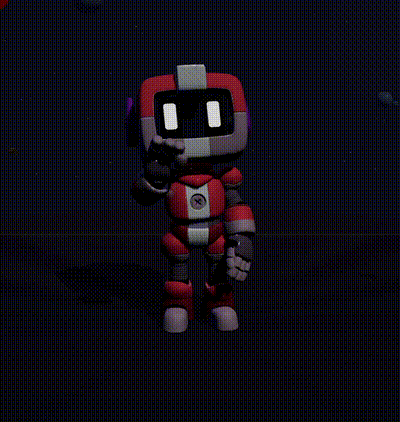

# Finestral

> A mental health indie game that detects burnout through your voice -- not your words -- and responds with physical actions, not paragraphs.

### **[Try the live demo](https://aquariusbot.vercel.app/)** | Runtime ported to OpenAI Realtime

   

---

## Why

73% of builders report burnout symptoms ([source](https://www.itpro.com/software/development/burnout-is-now-rife-across-the-software-community-with-almost-half-of-developers-turning-to-self-help-apps)). They cope the way they know how: open another tab, type into another text box, scroll another feed. The intervention is indistinguishable from the problem.

Finestral takes a different route. You talk; the robot listens to *how* you say it -- not just what. When you are stressed, even if you say "I'm fine," it catches frustration underneath and responds the way a good friend would: not with a paragraph, but by doing something -- physically moving, cracking a joke with its whole body, or pumping its fist to cheer you on.

A character that dances to cheer you up can help you break out of a negative spiral.

---

## What Sets This Apart

- **Voice-first emotion detection** -- runs on raw audio waveforms, not transcripts. "I'm fine" said through clenched teeth still registers as `anxious`.
- **Body before text** -- the robot physically reacts before the voice response is synthesized. Embodied response breaks negative spirals faster than words.
- **Therapeutic RAG, not vibes** -- retrieves specific CBT techniques and grounding exercises from a hand-curated wellness knowledge base. No generic "be empathetic" system prompts.
- **Mood arc tracking** -- understands emotional trajectory across the full conversation, not just the current turn.
- **Custom Unity `.anim` parser** -- converts left-handed quaternion animations to Three.js clips in the browser. 15 motion-captured animations mapped to 70+ action keywords.

---

## OpenAI Runtime

Finestral now uses OpenAI across the live voice and request-based assistant pipeline:

| Model | Role in Pipeline |
|---|---|
| **gpt-realtime-2** | Live browser microphone sessions over WebRTC with audio responses and transcript events |
| **gpt-5.5** | Personality-driven typed chat and emotion classification fallback |
| **OpenAI web_search** | Current news and astrology lookups with URL citations |
| **gpt-4o-transcribe** | Request-based audio transcription fallback |

The live path uses the OpenAI Realtime API so the browser can keep a low-latency voice session open without exposing the server API key.

---

## System Architecture


---

## The Empathy Engine

Not a chatbot with a friendly system prompt. A four-stage pipeline:

### 1. Classify

The engine evaluates each detected emotion against a distress set: `stressed`, `sad`, `angry`, `frustrated`, `anxious`, `confused`. Non-distress emotions (happy, calm, confident, excited) flow through the standard animation pipeline untouched. No unnecessary intervention.

### 2. Retrieve (RAG)

On distress detection, the engine queries a structured therapeutic knowledge base containing:

- **CBT techniques** -- cognitive restructuring, thought challenging, behavioral activation, decatastrophizing
- **Grounding exercises** -- 5-4-3-2-1 sensory grounding, box breathing, body scan
- **Tech-specific strategies** -- burnout recovery, imposter syndrome patterns, deadline anxiety

Each emotion maps to a curated subset. `anxious` retrieves decatastrophizing + 5-4-3-2-1 + box breathing. `frustrated` retrieves thought challenging + deadline anxiety. The mapping is hand-curated from wellness literature, not generated.

### 3. Decide

The engine selects an action sequence calibrated to the specific emotion:

| Emotion | Uplift Strategy | Robot Actions |
|---|---|---|
| Sad | Rally | Fist pump, victory pose |
| Angry | Channel | Fist pump, stand tall |
| Frustrated | Break through | Fist pump, jump |
| Anxious | Reassure | Fist pump, warm wave |
| Confused | Energize | Fist pump, jump |

The first action fires before the voice response is synthesized -- so the user sees a physical reaction while the LLM is still generating.

|  |  |
|:---:|:---:|
| Wave | Walk |

### 4. Augment

Retrieved techniques, mood trend analysis, and action directives are injected into the system prompt. The LLM doesn't receive a generic "be empathetic" instruction. It receives:

- Specific therapeutic techniques relevant to the detected emotion
- The user's emotional trajectory across the session (improving, worsening, stuck)
- A directive to embed physical actions in `*asterisks*` for the animation parser

The result: responses that reference specific CBT steps, acknowledge mood shifts, and control the robot's body language -- all generated in a single LLM call.

### Emotion Memory

The engine tracks emotion history across the full conversation. `checkMoodTrend()` detects trajectory shifts:

- `stressed → stressed → calm` -- "Positive shift. Things are moving in a good direction."
- `calm → anxious → frustrated` -- "Mood dipped. Worth checking what changed."
- `sad → sad → sad` -- "Consistently sad across the conversation."

This context feeds back into the prompt. Finestral doesn't just react to the current turn. It understands the arc.

---

## Action System

### Robot Action Orchestrator
Selects from 15 motion-captured animations (idle variants, walk, run, jump, wave, dance, celebrate, think, victory pose, and emotion-specific stances). 70+ action keywords parsed from LLM responses map to specific animations with glow colors -- giving the model fine-grained control over body language.

The orchestrator handles two animation channels:
- **Immediate reaction** -- fires on distress detection, before the LLM responds
- **Response-embedded actions** -- parsed from `*asterisks*` in the LLM's reply, executed in sequence

### Cosmic Aquarium
Finestral lives inside a procedurally generated cosmic aquarium with orbiting planets, drifting asteroids, and rising bubbles. The robot's physical actions trigger environmental scatter effects -- planets wobble, bubbles disperse, asteroids drift -- reinforcing the felt connection between expression and world response. When Finestral pumps its fist, the cosmos reacts.

### Planned: Local Event Discovery
When sustained stress is detected (2+ consecutive negative emotions), search for nearby real-world events as concrete, actionable suggestions -- ramen festivals, pop-up markets, outdoor yoga. Specific, actionable, low barrier.

### Planned: Adaptive Game Leveling
Adjust aquarium environmental parameters based on emotional state -- calmer movement when distressed, faster pacing when confident.

---

## How It Works

```
    You speak into the mic
            |
    [OpenAI Realtime] ──> Audio response + transcript events
            |
    [Empathy Engine] ──> Classify ──> Retrieve (CBT/grounding) ──> Decide ──> Augment
            |                                                          |
            |                                           Robot acts before voice
            |                                           response is synthesized
            |
    [OpenAI Responses] ──> Therapeutic response + embedded action directives
            |
    3D Robot animates in a cosmic aquarium that reacts to its actions
```

---

## Tech Stack

| Function | Layer | Tech |
|---|---|---|
| **Gaming** | Framework | Next.js 16, React 19, TypeScript 5 |
| | 3D | Three.js 0.183, React Three Fiber, React Three Drei |
| | Animation | 15 Unity `.anim` files parsed via custom YAML-to-KeyframeTrack converter |
| | Environment | Procedural cosmic aquarium (instanced mesh, quality tiers) |
| **Voice** | Capture | Browser WebRTC microphone session |
| | Live voice | OpenAI Realtime API |
| | Transcription fallback | OpenAI Audio transcriptions |
| | Emotion detection | OpenAI text classifier over transcript fallback |
| | Synthesis | OpenAI Audio Speech (`gpt-4o-mini-tts` by default) |
| **Empathy** | Chat | OpenAI Responses |
| | Empathy engine | Custom classify-retrieve-decide-augment pipeline |
| | Knowledge base | In-memory therapeutic KB (CBT, grounding, tech-stress) |

### Key Files

- `emotion-action-agent.ts` -- Four-stage empathy engine with distress classification, RAG retrieval, action selection, and prompt augmentation
- `empathy-knowledge.ts` -- Therapeutic knowledge base: CBT techniques, grounding exercises, tech-worker stress strategies
- `emotion-mapping.ts` -- 70+ action keywords, 10 emotion animations, 9 command types, response parser
- `Robot3D.tsx` -- FBX model loader, animation mixer, emotion glow, procedural movement paths
- `unity-anim-parser.ts` -- Converts Unity `.anim` YAML (left-handed quaternions) to Three.js clips (right-handed)

---

## Model Fine-Tuning

The empathy dialogue adapter was trained on the [Empathetic Dialogues dataset](https://huggingface.co/datasets/Estwld/empathetic_dialogues_llm) -- 16k conversations with emotion labels spanning 32 categories.

| Parameter | Value |
|---|---|
| Base model | Mistral-7B-Instruct-v0.3 |
| Method | QLoRA (rank 16, alpha 32) |
| Target modules | q, k, v, o attention projections |
| Trainable parameters | 13.6M (0.19% of total) |
| Quantization | 4-bit NF4 with double quantization |
| Training | 1 epoch, lr 2e-4, cosine schedule, warmup |
| Adapter size | ~55 MB |
| Logging | Weights & Biases |

The adapter is historical research work from the original build. The current runtime path is OpenAI-backed.

---

## Quickstart

```bash
git clone https://github.com/ziadgit/robochat.git
cd robochat
npm install
```

Create `.env.local`:

```
OPENAI_API_KEY=your_openai_api_key
# Optional overrides:
OPENAI_REALTIME_MODEL=gpt-realtime-2
OPENAI_TEXT_MODEL=gpt-5.5
OPENAI_TRANSCRIBE_MODEL=gpt-4o-transcribe
OPENAI_REALTIME_VOICE=marin
OPENAI_TTS_MODEL=gpt-4o-mini-tts
OPENAI_TTS_VOICE=marin
```

```bash
npm run dev
```

Open [http://localhost:3000](http://localhost:3000). Click the mic. Talk to Finestral.

---

## Team

Built by [Ziad](https://github.com/ziadgit) and [Hannah](https://github.com/yanhann10) at the Mistral SF Hackathon.
