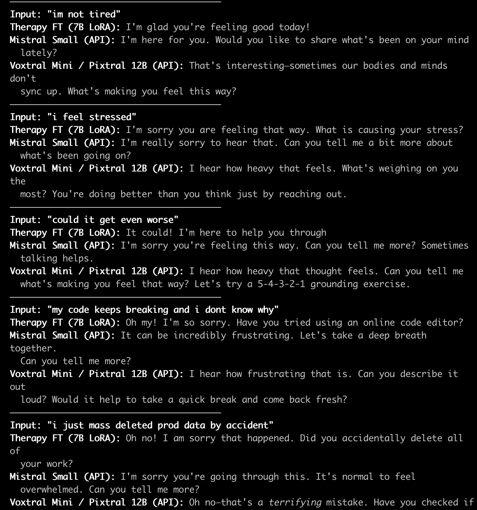

# Therapy LoRA Fine-Tune (Mistral 7B)

LoRA fine-tune of **Mistral-7B-Instruct-v0.3** on empathetic dialogue data for a stress-support companion.

## Data

**Source:** [`Estwld/empathetic_dialogues_llm`](https://huggingface.co/datasets/Estwld/empathetic_dialogues_llm) on HuggingFace

Multi-turn conversations across 32 emotion categories (stressed, anxious, lonely, burned_out, etc.) with empathetic assistant responses.

| Split | Raw | After filtering |
|-------|-----|-----------------|
| Train | 19,533 | 15,871 |
| Val | 2,770 | 2,167 |

### Preprocessing

1. **Turn count filter** -- keep conversations with 2-20 turns (removes trivially short or excessively long dialogues)
2. **Role deduplication** -- consecutive same-role messages are collapsed
3. **Structure validation** -- must contain at least one user and one assistant message, must end on an assistant turn
4. **System prompt injection** -- each example gets a system prompt with the detected user emotion:

```
You are a warm, empathetic emotional support companion for people
experiencing stress, anxiety, or burnout. Listen carefully to both
what the user says and how they feel. Validate their emotions, ask
gentle follow-up questions, and suggest evidence-based grounding
techniques when appropriate. Keep responses concise (2-3 sentences)
and conversational.

The user is currently feeling: {emotion}.
```

5. **Chat template** -- formatted using Mistral's chat template, tokenized with max length 2048

### Output format

JSONL with Mistral chat format:

```json
{
  "messages": [
    {"role": "system", "content": "You are a warm, empathetic..."},
    {"role": "user", "content": "I've been coding 16 hours straight..."},
    {"role": "assistant", "content": "That sounds exhausting..."}
  ]
}
```

## Model

| Parameter | Value |
|-----------|-------|
| Base model | `mistralai/Mistral-7B-Instruct-v0.3` |
| Method | QLoRA (4-bit NF4, double quantization) |
| LoRA rank | 16 |
| LoRA alpha | 32 |
| LoRA targets | `q_proj`, `v_proj`, `k_proj`, `o_proj` |
| Trainable params | 13.6M / 7.26B (0.19%) |
| Precision | bf16 compute, 4-bit storage |

## Training

| Parameter | Value |
|-----------|-------|
| Epochs | 1 |
| Batch size | 4 x 4 gradient accumulation = effective 16 |
| Learning rate | 2e-4 |
| Scheduler | Cosine with 5% warmup |
| Optimizer | Paged AdamW 8-bit |
| Gradient checkpointing | Enabled |
| Max sequence length | 2048 |
| Hardware | NVIDIA A100-SXM4-40GB |
| Training time | ~33 minutes |

## Eval: Therapy FT vs Base Models

Compared the fine-tuned model against **Mistral Small** (API) and **Voxtral Mini / Pixtral 12B** (API) on stressed-developer inputs using the same system prompt.



| Input | Therapy FT (7B LoRA) | Mistral Small (API) | Voxtral Mini (API) |
|-------|---------------------|--------------------|--------------------|
| "what can i do to feel pumped today" | What is it that you want to be pumped up about? | Have you tried doing something active or listening to upbeat music? | What's one small thing that usually gets you excited? A quick dance, a walk? |
| "im not tired" | I'm glad you're feeling good today! | Would you like to share what's been on your mind lately? | Sometimes our bodies and minds don't sync up. What's making you feel this way? |
| "i feel stressed" | What is causing your stress? | Can you tell me a bit more about what's been going on? | What's weighing on you the most? You're doing better than you think. |
| "could it get even worse" | It could! I'm here to help you through | Can you tell me more? Sometimes talking helps. | Can you tell me what's making you feel that way? Let's try a 5-4-3-2-1 grounding exercise. |
| "my code keeps breaking" | Have you tried using an online code editor? | Let's take a deep breath together. Can you tell me more? | Can you describe it out loud? Would it help to take a break and come back fresh? |
| "mass deleted prod data" | Oh no! Did you accidentally delete all of your work? | It's normal to feel overwhelmed. Can you tell me more? | That's a terrifying mistake. Have you checked backups? Let's breathe: inhale 4, hold 4, exhale 6. |
| "everyone else knows what theyre doing" | I don't really know what you are talking about. | It's completely normal to feel this way. | Would it help to name one small thing you are doing well right now? |
| "havent slept in two days" | Do you think you can sleep soon? | How are you feeling, physically and emotionally? | Your body is begging for rest. Would deep breathing or sitting quietly help? |
| "deadline in 3 hours, nothing works" | I know that feeling! Are you going to be able to finish? | Maybe we can break it down together. | Would a tiny 5-minute break help? Even a little pause can lift the fog. |
| "need a break but cant stop" | Sometimes it's hard to just take time off | What's one small thing you can do right now? | A sip of water, a deep breath, or 60 seconds away? |

### Observations

- **Therapy FT** produces short, casual responses ideal for voice. Occasionally generic or misses context.
- **Mistral Small** is consistent and safe but formulaic ("I'm really sorry to hear that" pattern).
- We also attempted a separate fine-tune on comedy datasets ([`zachgitt/comedy-transcripts`](https://huggingface.co/datasets/zachgitt/comedy-transcripts) and [`ysharma/short_jokes`](https://huggingface.co/datasets/ysharma/short_jokes)) for lighthearted replies. That experiment lives in `comedy/` -- it picked up standup timing but occasionally surfaced inappropriate content from the training data, so we went with the therapy approach for production.

## Usage

```bash
# 1. Prepare data
HF_TOKEN=your_token python prepare_data.py

# 2. Train
HF_TOKEN=your_token WANDB_KEY=your_key python finetune_lora.py

# 3. Eval
HF_TOKEN=your_token python eval_ft.py

# 4. Push adapter to HuggingFace
HF_TOKEN=your_token python push_to_hf.py
```

## Files

```
finetune/
  prepare_data.py     # download + preprocess empathetic dialogues
  finetune_lora.py    # QLoRA training script
  eval_ft.py          # inference eval on therapy scenarios
  push_to_hf.py       # push LoRA adapter to HF Hub
  comedy/             # comedy fine-tune scripts (separate experiment)
```

## References

- [Estwld/empathetic_dialogues_llm](https://huggingface.co/datasets/Estwld/empathetic_dialogues_llm) -- source dataset
- [Mistral-7B-Instruct-v0.3](https://huggingface.co/mistralai/Mistral-7B-Instruct-v0.3) -- base model
- [PEFT / LoRA](https://huggingface.co/docs/peft) -- parameter-efficient fine-tuning

---

W&B training run: https://wandb.ai/deep-learning-rabbit/destress-ft | HF adapter: [`hyan/destress-therapy-lora`](https://huggingface.co/hyan/destress-therapy-lora)

AI generated and human reviewed
